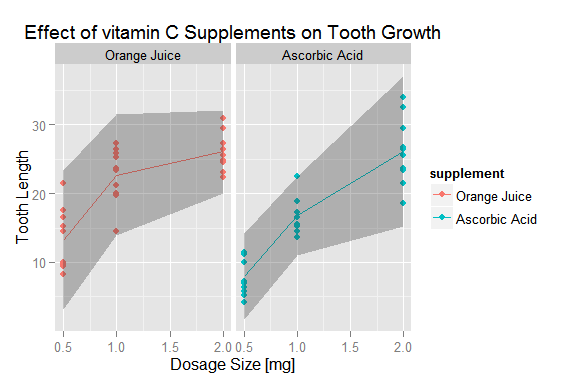

# Does the Type of Vitamin C Supplement Affect Tooth Growth?
MattDSquared  
Saturday, June 20, 2015  

## Question
By looking at the R datasets package for ToothGrowth, does the type of supplement used for vitamin C delivery have an effect on tooth growth in guinea pigs?

_This project is a part of the Coursera Statistical Inference Class._

## Project Setup

The original data set (as found by calling `?ToothGrowth` from Rstudio) comes from a study by C. I. Bliss focusing on length of odontoblasts (teeth) in each of 10 guinea pigs at each of three dose levels of Vitamin C (0.5, 1, and 2 mg) with each of two delivery methods (orange juice or ascorbic acid).


```r
library(datasets)
library(ggplot2)
library(plyr); library(dplyr)
library(knitr)
data(ToothGrowth) # loads ToothGrowth data frame

# rename variables for plotting clarity
names(ToothGrowth) <- c("length","supplement","dose")

# assign more clear supplement labels
ToothGrowth$supplement <- factor(ToothGrowth$supplement, levels=c("OJ","VC"), labels=c("Orange Juice", "Ascorbic Acid"))

# number of guinea pigs per sample
n <- 10
```

## Exploratory Analysis
What are the general trends in tooth length vs supplement delivery method and dosage? Let's assume the underlying distribution is iid normally distributed and the confidence bounds of any 10-guinea-pig group can be explained by a t distribution with degrees of freedom, n-1=9. 


```r
df <- n-1
ToothStats <- ToothGrowth %>% 
    group_by(supplement,dose) %>%
    summarize(mean_length = mean(length), sd_length=sd(length), 
              lbound=mean_length-qt(.975,df)*sd_length,
              ubound=mean_length+qt(.975,df)*sd_length)
```

The statistics for this data set are shown below.


```r
kable(ToothStats, format="markdown", digits = 2,
      col.names=c("Supplement","Dosage (mg)","Mean Length","Std Dev Length",
                  "95% Interval, Lower","95% Interval, Upper"))
```


|Supplement    | Dosage (mg)| Mean Length| Std Dev Length| 95% Interval, Lower| 95% Interval, Upper|
|:-------------|-----------:|-----------:|--------------:|-------------------:|-------------------:|
|Orange Juice  |         0.5|       13.23|           4.46|                3.14|               23.32|
|Orange Juice  |         1.0|       22.70|           3.91|               13.85|               31.55|
|Orange Juice  |         2.0|       26.06|           2.66|               20.05|               32.07|
|Ascorbic Acid |         0.5|        7.98|           2.75|                1.77|               14.19|
|Ascorbic Acid |         1.0|       16.77|           2.52|               11.08|               22.46|
|Ascorbic Acid |         2.0|       26.14|           4.80|               15.29|               36.99|

The plot below shows how tooth length varies by supplement type and dosage. The line plot connects the group means, with the 95% confidence interval shown in grey.


```r
gg <- ggplot() +
    facet_grid(. ~ supplement) +
    geom_point(data=ToothGrowth, 
               aes(x=dose,y=length, color=supplement)) +
    geom_line(data = ToothStats, 
              aes(x=dose, y=mean_length, color=supplement)) +
#    geom_errorbar(data = ToothStats, 
#                  aes(x=dose, ymin=lbound, ymax=ubound)) +
    geom_ribbon(data = ToothStats, 
                  aes(x=dose, ymin=lbound, ymax=ubound), 
                alpha=.3) +
    labs(title="Effect of vitamin C Supplements on Tooth Growth") +
    labs(x="Dosage Size [mg]") +
    labs(y="Tooth Length")
print(gg)
```

 

It certainly appears that orange juice does improve tooth growth on average, however let's use t-tests to understand if these differences are significant. 

## Significance of Supplement type by dose on length of tooth
The objective of this study is to determine whether or not one supplement significantly increases tooth growth over the other at a given dosage. Or more formally:

H~0~: Supplement type has no effect on tooth length at any dosage level.  
H~a~: Supplement type has a non-zero effect on tooth length at any dosage level.  

As stated earlier, assume the underlying distribution is iid normal, with the t distribution able to explain the distribution of this small sample size. 


```r
# t-test for dosage significance
dose.t.test <- function(dose1, dose2, supp=c("Orange Juice","Ascorbic Acid")) {
    dat  <- filter(ToothGrowth, (dose %in% c(dose1,dose2)) & 
                       (supplement %in% supp))
    dose.t <- t.test(data = dat, 
                     length ~ dose, 
                     paired = FALSE, var.equal = FALSE)
    case.name <- paste(paste(supp, collapse=", "),": dosage ", dose1,
                       " - ",dose2, sep="")
    dose.t <- with(dose.t, data.frame(statistic, parameter, p.value, 
                                      conf.int[1], conf.int[2],
                                      row.names=case.name))
    names(dose.t) <- c("t","df","p.value","conf.int.l","conf.int.u")
    dose.t
}

# t-test for supplement groups between each dosage
supp.t.test <- function(dosage) {
    supp.t <- t.test(data = filter(ToothGrowth, dose == dosage), 
                     length ~ supplement, 
                     paired = FALSE, var.equal = FALSE)
    case.name <- paste("dosage:",dosage, ", OJ - AA", sep="")
    supp.t <- with(supp.t, data.frame(statistic, parameter, p.value, 
                                      conf.int[1], conf.int[2],
                                      row.names=case.name))
    names(supp.t) <- c("t","df","p.value","conf.int.l","conf.int.u")
    supp.t
}

t.stats <- rbind(dose.t.test(.5,1), dose.t.test(1,2), 
                 dose.t.test(1,2,"Orange Juice"), 
                 dose.t.test(1,2,"Ascorbic Acid"),
                 supp.t.test(.5), supp.t.test(1), supp.t.test(2))
```
The table below shows the t test for significance between different dosage levels as well as between Orange Juice and Ascorbic Acid supplement (in that order) for each dosage level. 

```r
kable(t.stats, format="markdown", digits = 3,
      col.names=c("t statistic","df","p-value",
                  "95% t-interval, lower","95% t-interval, upper"))
```


|                                            | t statistic|     df| p-value| 95% t-interval, lower| 95% t-interval, upper|
|:-------------------------------------------|-----------:|------:|-------:|---------------------:|---------------------:|
|Orange Juice, Ascorbic Acid: dosage 0.5 - 1 |      -6.477| 37.986|   0.000|               -11.984|                -6.276|
|Orange Juice, Ascorbic Acid: dosage 1 - 2   |      -4.900| 37.101|   0.000|                -8.996|                -3.734|
|Orange Juice: dosage 1 - 2                  |      -2.248| 15.842|   0.039|                -6.531|                -0.189|
|Ascorbic Acid: dosage 1 - 2                 |      -5.470| 13.600|   0.000|               -13.054|                -5.686|
|dosage:0.5, OJ - AA                         |       3.170| 14.969|   0.006|                 1.719|                 8.781|
|dosage:1, OJ - AA                           |       4.033| 15.358|   0.001|                 2.802|                 9.058|
|dosage:2, OJ - AA                           |      -0.046| 14.040|   0.964|                -3.798|                 3.638|

## Conclusion
The t-tests show two things. First, the difference between dosage levels is significant to a maximum p-value of 4% for all groups. Second, at a dosage level of 0.5 and 1.0 mg, Orange Juice has a significantly greater effect on increasing tooth growth than Ascorbic Acid (p-value < 1%). However, at a dosage level of 2.0 mg, there is no significant difference between the two supplements. With this information we can decide H~a~, supplement type has an effect on tooth growth, but only at certain dosage levels.
